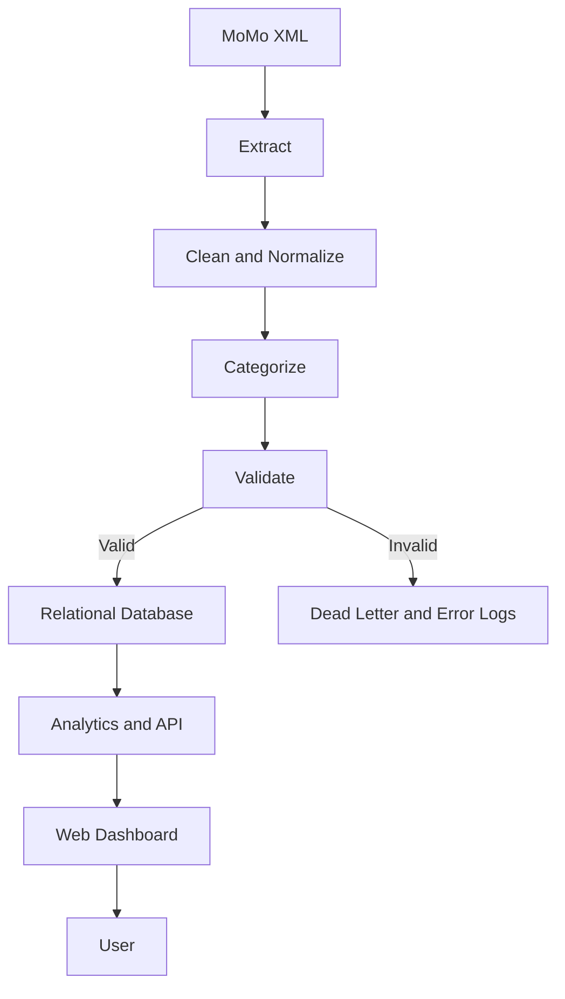
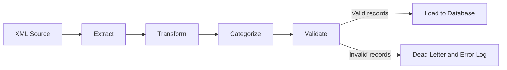

# MoMo SMS Transaction Analytics Platform

The **MoMo SMS Transaction Analytics Platform** processes Mobile Money (MoMo) transaction data in XML format. It transforms raw SMS transaction information into structured, validated data for storage, analysis, and visualization.

The platform will:

- Extract transaction information from XML
- Clean and normalize transaction data
- Categorize transactions according to defined business rules
- Validate transaction records
- Store structured information in a relational database
- Generate transaction analytics and trends
- Provide an interactive web dashboard
- Allow users to explore transactions through charts, statistics, tables, search, and filtering

> **Implementation status:** The repository is in the **Team Setup and Project Planning** phase. The architecture, commands, API, ETL pipeline, and dashboard described below are not yet implemented.

## Team

### Team Name

[Web404]

### Team Members

| Name | Role | GitHub |
|---|---|---|
| Benson Maina | Member | [ben-m-m](https://github.com/ben-m-m) |
| Gahima Denilson Nziza | Member | [Nzizadenilson](https://github.com/Nzizadenilson) |
| Oteniya Oluwatobi Jeremiah | Member | [oteniyatobi](https://github.com/oteniyatobi) |

## Week 1 Deliverables

Week 1 covers project setup, collaboration, architecture, and Agile/Scrum organization.

- [x] Team GitHub repository created
- [x] Team collaboration setup completed
- [x] High-level architecture defined
- [x] Agile/Scrum organization established

The ETL pipeline, database, API, and dashboard will be implemented in later phases.

## Problem Statement

MoMo transaction information may be stored in SMS messages and represented in XML format. Raw transaction data is difficult to analyze directly because it can contain inconsistent formatting, embedded information, duplicate records, missing fields, and different representations of amounts, dates, phone numbers, and transaction types.

The platform will transform this information into structured transaction records through extraction, cleaning, normalization, categorization, validation, storage, and analysis. Users will explore their transaction history through a web dashboard.

## Project Objectives

1. Parse MoMo SMS XML data.
2. Extract relevant transaction information.
3. Clean and normalize transaction records.
4. Categorize transactions using defined business rules.
5. Validate transaction data.
6. Store structured data in a relational database.
7. Generate useful financial analytics.
8. Provide a web-based visualization dashboard.
9. Support transaction searching and filtering.
10. Implement automated testing.
11. Use Git and GitHub for collaborative development.
12. Follow Agile/Scrum project management practices.

## System Workflow

The high-level data flow is:



## System Architecture

### Data Source

The data source is raw MoMo SMS transaction data in XML format.

### ETL Layer

The Extract, Transform, Load (ETL) layer will:

- Extract transaction information from XML
- Transform source values into consistent formats
- Clean and normalize records
- Categorize transactions
- Validate required fields and business rules
- Load valid records into the database
- Record invalid or unparseable records for review

### Database Layer

The database layer will store cleaned transaction records, categories, and processing information. The design will be refined during implementation.

### Analytics Layer

The analytics layer will calculate transaction statistics, totals, category summaries, and trends for the dashboard.

### Backend/API Layer

A FastAPI backend may expose processed transaction data and analytics to the frontend. Endpoints may include:

```text
GET /transactions
GET /analytics
```

These endpoints are not yet implemented.

### Frontend Layer

The dashboard will use HTML, CSS, JavaScript, and Chart.js to present transaction information through tables, filters, statistics, and interactive charts.

### User Layer

Users will explore transaction information, review summaries, search records, apply filters, and analyze financial trends.

## System Architecture Diagram

The editable architecture diagram is maintained in [Miro](https://miro.com/app/board/uXjVHq1pkp8=/?share_link_id=500817655064) and will be exported to `docs/architecture.png`.

## Technology Stack

Technology stack:

| Layer | Technology | Purpose |
|---|---|---|
| Programming Language | Python | ETL and backend development |
| XML Processing | ElementTree / lxml | XML parsing |
| Database | SQLite / MySQL | Relational data storage |
| Backend | FastAPI | Optional API layer |
| Frontend | HTML5 | Dashboard structure |
| Styling | CSS3 | Dashboard styling |
| Frontend Logic | JavaScript | Interaction and data handling |
| Visualization | Chart.js | Charts and analytics |
| Testing | pytest | Automated testing |
| Version Control | Git / GitHub | Collaboration and source control |
| Project Management | Trello | Agile task management |

## Codebase Structure

The repository currently has the following structure:

```text
.
├── README.md
├── .gitignore
├── modified_sms_v2.xml
├── Digarams/
│   ├── Architeture Diagram.png
│   └── Database Architeture Diagram (Edited).png
└── ERD Design/
   ├── Documentaion.md
   └── ERD Image.png
```

Directory responsibilities:

- `modified_sms_v2.xml`: source MoMo SMS data used for analysis and processing.
- `Digarams/`: architecture and database architecture diagram images.
- `ERD Design/`: database ERD image and documentation explaining the schema decisions.

## ETL Pipeline

The ETL pipeline converts raw XML transaction data into validated records for database storage and analysis.

### Extract

Read and parse the source XML data, identifying transaction messages and their relevant fields.

### Transform

Clean and normalize:

- Amounts
- Dates
- Phone numbers
- Text
- Missing values
- Duplicate records

### Categorize

Classify transactions into categories such as:

- Received
- Sent
- Transfer
- Withdrawal
- Deposit
- Airtime
- Payment
- Fees
- Other

### Validate

Verify that records contain valid and required information before they are loaded into the database.

### Load

Store valid records in the relational database. Record invalid or unparseable records separately for investigation.



## Database

The relational database will store structured transaction records and processing information. It may contain:

- Transactions
- Categories
- Processing logs

The database design will be refined during development based on the source XML structure and application requirements.

### Database ERD

The database ERD is available in the repository and in Lucidchart:

- [ERD Image](ERD%20Design/ERD%20Image.png)
- [ERD Design Documentation](ERD%20Design/Documentaion.md)
- [Editable Lucidchart ERD](https://lucid.app/lucidchart/34908f11-d5b6-4716-b5be-23a0328c8ced/edit?viewport_loc=-19%2C0%2C2570%2C1094%2C0_0&invitationId=inv_1da15af1-75b6-4b3a-aa60-be9354d449e4)

## Dashboard

The dashboard will provide an interactive interface for exploring transaction data. Components include:

- Total transactions
- Total money received
- Total money sent
- Withdrawals
- Deposits
- Fees
- Transaction categories
- Transaction trends
- Income versus expenditure
- Search
- Filters
- Transaction table
- Interactive charts

### Dashboard Preview

Dashboard mockups and screenshots will be added during frontend development.

## API

The API is an optional component for a later implementation phase. Endpoints may include:

```text
GET /transactions
GET /analytics
```

`GET /transactions` will provide transaction records with optional search and filter parameters. `GET /analytics` will provide totals, category summaries, and trends. These endpoints are not yet implemented.

## Error Handling

Invalid or unparseable records are handled separately rather than discarded. The error path is:

```text
Invalid XML / Transaction
	↓
Dead Letter / Error Log
```

Log locations:

```text
data/logs/etl.log
data/logs/dead_letter/
```

## Testing

The test strategy includes:

- XML parser unit tests
- Cleaning and normalization tests
- Categorization tests
- Database and integration tests
- API tests if the API is implemented
- Frontend testing where appropriate

The `tests/` directory contains tests for parsing, normalization, categorization, database behavior, and other implemented components.

## Agile / Scrum

The team uses Agile/Scrum practices to organize development. Work is divided into tasks, assigned, reviewed, and tracked throughout the project.

The basic workflow is:

```text
To Do → In Progress → Done
```

## Scrum Board

The team uses Trello to plan, assign, track, and manage project tasks.

**Trello Board:** [MoMo SMS Data Processing System](https://trello.com/invite/b/6a9be789a3edbea0c02c814d/ATTI98b8476bd1ac679ac290000bd80b42e6E6C56482/momo-sms-data-processing-system)

Initial tasks include:

- Repository setup
- Team member setup
- Architecture diagram
- Project structure
- XML research
- Database design
- ETL design
- Dashboard design
- Testing strategy

## Development Workflow

The Git workflow is:

```text
Task
 ↓
Feature Branch
 ↓
Development
 ↓
Testing
 ↓
Commit
 ↓
Push
 ↓
Pull Request
 ↓
Code Review
 ↓
Merge
 ↓
Task marked Done
```

Example branch names include:

```text
feature/xml-parser
feature/database
feature/dashboard
feature/analytics
fix/parser-error
test/categorization
```

## Environment Configuration

Environment-specific configuration should not be committed to GitHub. Developers should keep local secrets and machine-specific values in a `.env` file, while `.env.example` documents the required variable names without containing real credentials or private values.

Example:

```text
DATABASE_URL=your_database_url_here
```

Each developer should create their own local `.env` file based on `.env.example`.

## Installation and Setup

Setup instructions:

1. Clone the repository:

   ```bash
   git clone https://github.com/ben-m-m/momo_pay_analytics.git
   cd momo_pay_analytics
   ```

2. Create a Python virtual environment:

   ```bash
   python3 -m venv venv
   ```

3. Activate the virtual environment:

   ```bash
   source venv/bin/activate
   ```

4. Install the requirements:

   ```bash
   pip install -r requirements.txt
   ```

5. Configure environment variables by creating a local `.env` file from `.env.example`.

## Commands

These commands are not yet implemented.

Run the ETL pipeline:

```bash
python etl/run.py --xml data/raw/momo.xml
```

Run the optional API if it is implemented:

```bash
uvicorn api.app:app --reload
```

## Project Roadmap

- [x] **Phase 1 — Team Setup & Planning**
- [ ] **Phase 2 — XML Research & ETL**
- [ ] **Phase 3 — Database**
- [ ] **Phase 4 — Backend/API**
- [ ] **Phase 5 — Frontend Dashboard**
- [ ] **Phase 6 — Integration**
- [ ] **Phase 7 — Testing**
- [ ] **Phase 8 — Deployment & Final Presentation**

The expected progression is:

```text
Phase 1 — Team Setup & Planning
	↓
Phase 2 — XML Research & ETL
	↓
Phase 3 — Database
	↓
Phase 4 — Backend/API
	↓
Phase 5 — Frontend Dashboard
	↓
Phase 6 — Integration
	↓
Phase 7 — Testing
	↓
Phase 8 — Deployment & Final Presentation
```

## Current Project Status

### Team Setup

- [x] Repository created
- [x] Team members added
- [x] README completed

### Project Organization

- [x] Directory structure created
- [x] `.gitignore` configured
- [x] `.env.example` created
- [ ] Requirements documented

### Architecture

- [x] Architecture designed
- [x] Architecture diagram completed
- [ ] Architecture diagram committed to repository

### Agile

- [x] Trello board created
- [x] To Do column created
- [x] In Progress column created
- [x] Done column created
- [x] Initial tasks added
- [x] Trello link added to README

## Project Links

| Resource | Link |
|---|---|
| GitHub Repository | [momo_pay_analytics](https://github.com/ben-m-m/momo_pay_analytics) |
| Project Structure | Documented above |
| Architecture Diagram | [Miro architecture board](https://miro.com/app/board/uXjVHq1pkp8=/?share_link_id=500817655064) |
| Trello Board | [MoMo SMS Data Processing System](https://trello.com/invite/b/6a9be789a3edbea0c02c814d/ATTI98b8476bd1ac679ac290000bd80b42e6E6C56482/momo-sms-data-processing-system) |
| Database ERD | [ERD Image](ERD%20Design/ERD%20Image.png) · [Lucidchart ERD](https://lucid.app/lucidchart/34908f11-d5b6-4716-b5be-23a0328c8ced/edit?viewport_loc=-19%2C0%2C2570%2C1094%2C0_0&invitationId=inv_1da15af1-75b6-4b3a-aa60-be9354d449e4) |
| Project Documentation | [README](README.md) · [ERD documentation](ERD%20Design/Documentaion.md) |

## Academic Context

This project is being developed as part of an enterprise-level full-stack software engineering course and continuous formative assessment.

```text
Institution: [African Leadership University]
Course/Module: [BSc. Software Engineering]
Academic Year: 2026
Team: [Web404]
```